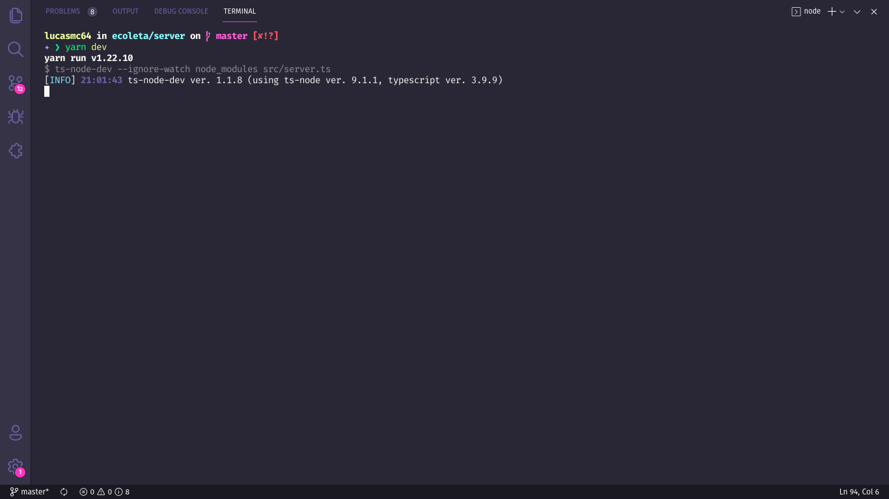
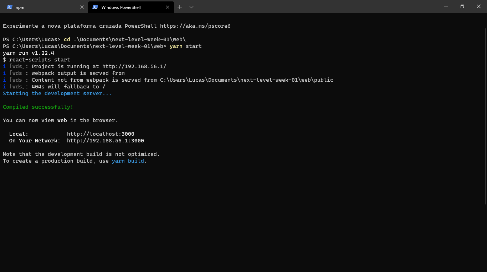
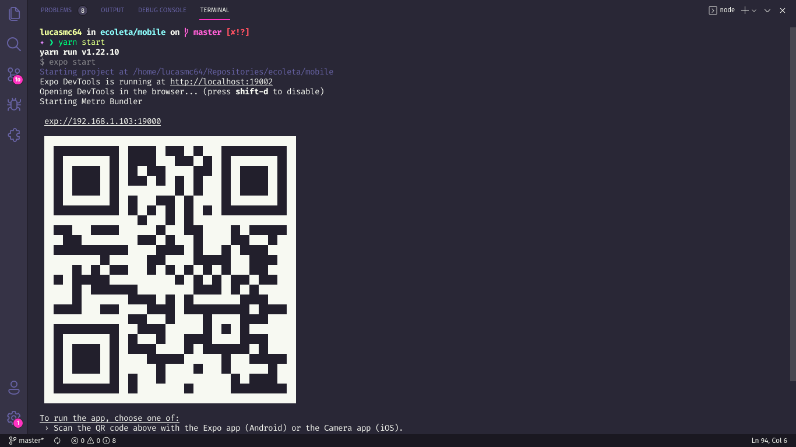
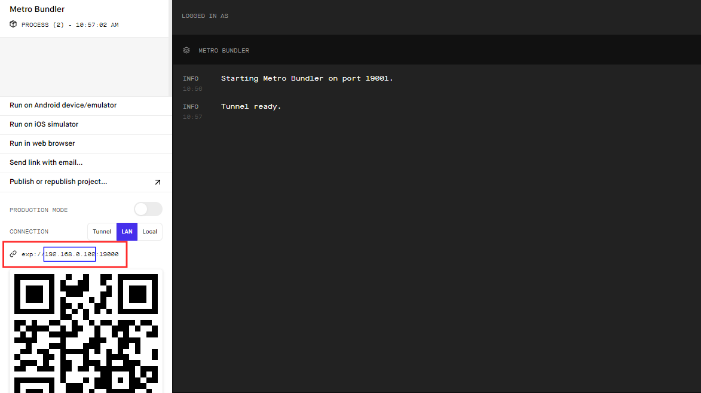

# :recycle: Ecoleta

> This was a project developed during Next Level Week #01 (Track: Booster).

## :rocket: What is Next Level Week?

The [NLW](https://nextlevelweek.com/) is a week programmed by [Rocketseat](https://rocketseat.com.br/) in which, through classes, lives, practice and with support from the community, it will help you take the next step in your evolution as a dev.

## :mountain: What is the difference between the Booster and Starter tracks?

This edition of NLW offers two different fronts according to the student's knowledge:

- The “Starter” path is for those who are just beginning to learn application development;
- The "Booster" path is for those who are willing to go a step further and who already have basic development concepts. 

## :dart: Goal

Concerned about environmental pollution and how it will impact our lives in the future, Ecoleta arrives to help people find collection points for recycling efficiently, in order to avoid the waste disposal in a wrong way and promote the reuse of components.

## :scroll: Some details

- The back-end is built with Node.JS, Express and SQLite;
- The font-end is built with the ReactJS framework.
- The mobile is built with the React Native framework and the Expo platform.

## :thinking: How do I run the project on my machine?

The first step is to clone the project, either via terminal or GitHub Desktop, or even by downloading the compressed file (.zip). After that, go ahead.

### :hammer_and_wrench: Requirements

- [Node.JS](https://nodejs.org/).
- (Optional) [Yarn](https://yarnpkg.com/).

### :mag: Installing dependencies

With Node.JS installed, access each of the directories (**server**, **web** and **mobile**) via terminal and run the `npm install` command. If you prefer to use Yarn, just run the command `yarn`.

### :goggles: Running the Back-end

Access the **server** directory via terminal, run the command `npm run dev` or ` yarn dev` and a message similar to the following will appear for you:

> If this was not the result, check that the requirements and previous steps have been met.

### :sparkles: Running the Front-end

Access the **frontend** directory via terminal, run `npm start` or `yarn start`. A message similar to the following will appear for you:

Automatically, in your default browser, a tab will open for the link http://localhost:3000/ (where the project will be running).

> If this was not the result, check that the requirements and previous steps have been fulfilled.

### :iphone: Running Mobile

#### :hammer_and_wrench: Requirements

- Expo app: ([Android](https://play.google.com/store/apps/details?id=host.exp.exponent) - [iOS](https://apps.apple.com/br/app/expo-client/id982107779)).
- [Expo Command Line](https://expo.io/learn).

#### :hiking_boot: Steps

Access the **mobile** directory via terminal and run `npm start` or ` yarn start`.

Then, a message similar to the following will appear for you:

Automatically, in your default browser, a tab will open for the link http://localhost:9002/ with the following screen:

As you can see, there is a QRCode both on the terminal and on the website that opened (they are the same). Now, open the Expo app on your smartphone, scan the QRCode and wait until the project is synchronized.

> If this was not the result, check that the requirements and previous steps have been fulfilled.
### A few small details... :brain:

#### :game_die: Database

We have a few more things to do. As my intention in this project was purely educational, I uploaded the project together with my test database.

Ideally, before you run the project on your computer, do the following steps:

1. Open the folder *server/src/database/* and delete the archive *database.sqlite*.
2. Open the folder *server/uploads/* and delete all files that do not have the extension *.svg*.
3. Open the terminal in the folder *server* and run the following command: `npm run knex:migrate` or `yarn knex:migrate`.
4. Still in the open terminal in the folder *server* and run the following command: `npm run knex:seed` or `yarn knex:seed`.

#### :triangular_flag_on_post: Switching to your IP 

As we are running the project locally, the routes are based on the computer's current IP, so it may be necessary to change them. But how do I know my IP of localhost? One way is, when you run the *mobile* project, when you open the browser window, look at the address on the left side of the site or in the browser bar:

Above, in the blue rectangle, is your current local IP.

Follow the steps for replacement:

##### :goggles: Back-end

Access the *server* folder and change the IP in the following files:

- *server/src/controllers/ItemsController.ts* - line 11.
- *server/src/controllers/PointsController.ts* - line 15, line 33.

##### :sparkles: Front-end

There are no lines that need to be changed.

##### :iphone: Mobile

Access the *mobile* folder and change the IP in the following files:

* *mobile/src/services/api.ts* - line 4.

## :tada: If everything went well...

Now you are running the project beautifully!

## :memo: License

This project is under the MIT license. See the [LICENSE](LICENSE) for more information.

---

Made with :white_heart: by Lucas Coutinho :wave: [Get in touch!](https://www.linkedin.com/in/lucasmc64/)